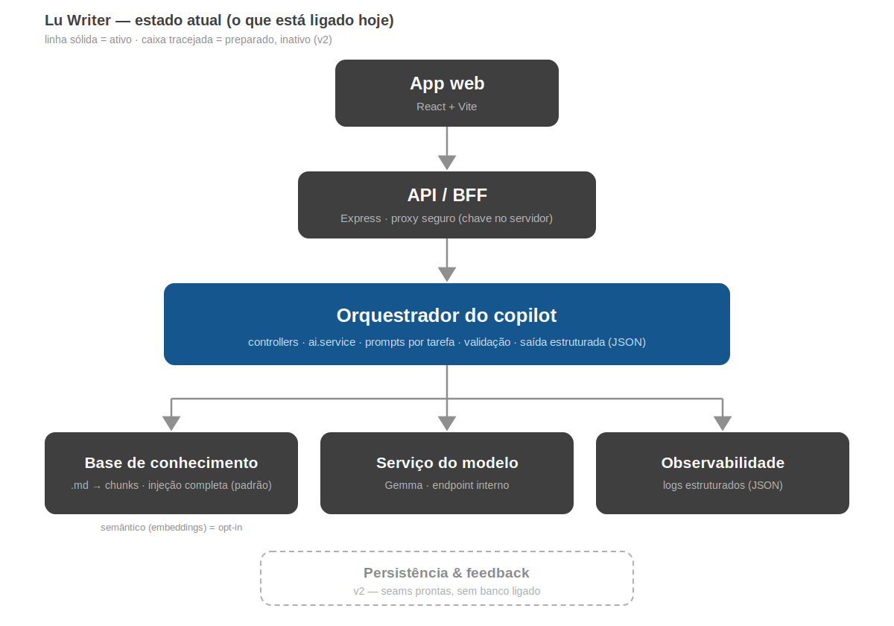
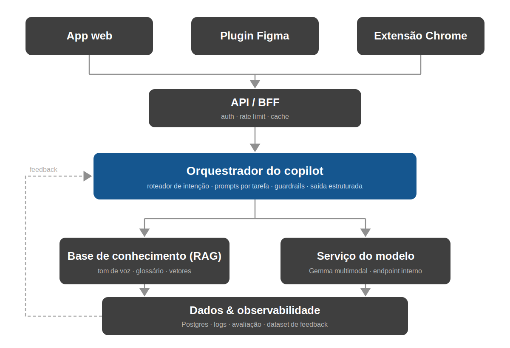
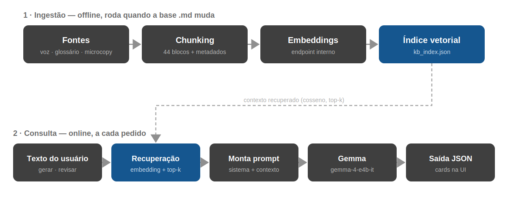

# Arquitetura — Lu Writer

Documentação técnica completa do copiloto de UX Writing do Magalu: visão geral,
arquitetura conceitual, implementação real, camada de RAG, fluxo de dados,
módulos, configuração, segurança e roadmap.

---

## 1. Visão geral

O **Lu Writer** é uma aplicação full-stack (padrão **BFF — Backend For
Frontend**) que ajuda Designers, PMs e Devs a **gerar, revisar, normalizar e
explicar** textos de interface, sempre alinhados ao tom de voz e às regras de
padronização do Magalu. A inteligência vem de um LLM (`google-gemma-4-e4b-it`)
servido por um endpoint de inferência interno, e toda decisão é **fundamentada
numa base de conhecimento oficial** — nunca no conhecimento genérico do modelo.

Princípios de projeto:

- **A orquestração é o produto, não o modelo.** O LLM é uma peça substituível.
- **Fonte de verdade única.** A base vive em arquivos `.md`; o resto é derivado.
- **Saída estruturada.** O modelo devolve JSON validável, não texto solto.
- **Falhar de forma clara.** Sem segredos no código, sem respostas silenciosas.
- **Evolução incremental.** Cada capacidade nova entra sem quebrar o que existe.

---

## 2. Arquitetura

### 2.1 Estado atual (o que está ligado hoje)



Este é o fluxo real em produção: **App web → API/BFF → Orquestrador →
{base de conhecimento, serviço do modelo, observabilidade}**. A recuperação
semântica (embeddings) é **opt-in**; persistência e feedback são **seams
preparadas para a v2**, ainda sem banco ligado.

### 2.2 Arquitetura-alvo (conceitual)

O desenho abaixo é a visão-**alvo** de um copiloto de UX Writing. Nem tudo está
implementado hoje (ver seção 3) — itens como Extensão Chrome, persistência
(Postgres) e o feedback loop são v2.



O coração é o **Orquestrador**: recebe a intenção (gerar / revisar / explicar /
analisar), escolhe o prompt da tarefa, injeta o contexto da base de
conhecimento, chama o modelo, valida a saída estruturada e devolve para a UI.

---

## 3. Conceito × implementação atual

| Camada do diagrama | Estado hoje | Onde no código |
|---|---|---|
| App web | ✅ Implementado (React + Vite) | `src/` |
| Plugin Figma | ⚪ Parcial — há proxy de imagem do Figma | `server/controllers/figma.controller.ts` |
| Extensão Chrome | 🔜 Conceitual (v2) | — |
| API / BFF | ✅ Express como proxy seguro | `server.ts`, `server/routes/api.ts` |
| Orquestrador | ✅ Prompts por tarefa + saída estruturada + guardrails | `server/controllers/`, `server/services/ai.service.ts` |
| Base de conhecimento (RAG) | ✅ Chunking + keyword + semântico | `src/ai/`, `server/services/vectorIndex.ts` |
| Serviço do modelo | ✅ Gemma via endpoint interno (SDK `openai`) | `server/services/ai.service.ts`, `server/config.ts` |
| Dados & observabilidade | ⚪ Logs prontos; persistência é **v2** | `server/logger.ts`, `server/db/schema.v2.sql` |
| Feedback loop | 🔜 Seam pronta, sem banco (v2) | `server/services/feedback.service.ts` |

Legenda: ✅ pronto · ⚪ parcial · 🔜 preparado para v2.

---

## 4. Estrutura de pastas

```text
├── src/                          # Frontend (React) + base de conhecimento
│   ├── components/               # Interface: Layout + os 4 modos
│   │   ├── ReviewMode.tsx
│   │   ├── GenerateMode.tsx
│   │   ├── ExplainMode.tsx
│   │   └── AnalyzeMode.tsx
│   ├── ai/
│   │   ├── knowledgeChunker.ts   # Fatia a base em chunks + retrieve (keyword)
│   │   └── knowledgeProvider.ts  # Injeção: completa | keyword | semântica
│   ├── knowledge_base/           # FONTE DE VERDADE (.md) + índice de embeddings
│   │   ├── lu_writer_system_prompt.md
│   │   ├── magalu_content_writing_dataset.md
│   │   ├── magalu_glossario.md
│   │   └── kb_index.json         # (gerado por npm run embeddings; git-ignored)
│   ├── App.tsx
│   └── HistoryContext.tsx        # Histórico de sessão (memória do navegador)
├── server/                       # Backend (Node.js / Express)
│   ├── config.ts                 # Configuração central (env, fail-loud)
│   ├── logger.ts                 # Log estruturado (JSON)
│   ├── controllers/
│   │   ├── ai.controller.ts      # review · generate · explain · analyze
│   │   ├── lint.controller.ts    # filtro determinístico
│   │   ├── feedback.controller.ts# seam v2
│   │   └── figma.controller.ts   # proxy de imagem do Figma
│   ├── services/
│   │   ├── ai.service.ts         # chamada ao LLM + validação + roteamento RAG
│   │   ├── embeddings.service.ts # gera vetores (endpoint interno)
│   │   ├── vectorIndex.ts        # índice local + busca por cosseno
│   │   ├── lint.ts               # regras de grafia
│   │   └── feedback.service.ts   # repositório (no-op hoje)
│   ├── db/schema.v2.sql          # Persistência (v2, ainda não usada)
│   └── routes/api.ts
├── scripts/build-embeddings.ts   # Ingestão offline do RAG
├── docs/                         # Esta documentação + diagramas
├── server.ts                     # Ponto de entrada do Express
└── package.json
```

---

## 5. Fluxo de uma requisição

1. O usuário interage com um dos 4 modos no React.
2. O front dispara `fetch` para `/api/{review|generate|explain|analyze}`.
3. O **controller** monta o prompt específico da tarefa + o `schema` JSON e
   deriva uma *query* do input do usuário.
4. `resolveSystemInstruction(query)` decide o contexto conforme `RAG_MODE`:
   injeção completa (`full`) ou top-k recuperado (`semantic`).
5. `ai.service` chama o LLM (`response_format: json_schema`, `temperature 0.1`),
   **valida** o JSON retornado e loga latência/status.
6. O controller devolve o JSON; o front renderiza como cards e salva no
   `HistoryContext`.

---

## 6. Camada de conhecimento & RAG

A base de conhecimento são os `.md` em `src/knowledge_base/`. Você edita só
eles. O `knowledgeChunker.ts` os fatia automaticamente em **44 blocos** com
metadados (`categoria`, `pilar`, `fonte`), derivados da estrutura existente.

Há três estratégias de contexto, em ordem de sofisticação:

| Estratégia | Função | Quando |
|---|---|---|
| Injeção completa | `buildSystemInstruction()` | Padrão. Base pequena cabe no contexto. |
| Recuperação por palavra-chave | `retrieve()` / `buildGroundedInstruction()` | Sem embeddings; fallback. |
| Recuperação semântica | `retrieveSemantic()` / `buildGroundedInstructionSemantic()` | Base grande; precisão. |

O modo é controlado por `RAG_MODE` (`full` | `semantic`). O caminho semântico
tem **fallback automático**: se o índice não existir ou o embedding falhar, cai
na recuperação por palavra-chave e loga o motivo — nada quebra.

### Pipeline de RAG



A **ingestão** é offline (`npm run embeddings`): fatia a base, gera embeddings
pelo endpoint interno e grava `src/knowledge_base/kb_index.json`. A **consulta**
é online: embeda o texto do usuário, faz cosseno contra o índice e injeta os
top-k blocos no prompt.

### Ativando o modo semântico

```bash
# 1) .env: aponte o modelo de embedding exposto pelo endpoint
LLM_EMBEDDING_MODEL="<nome-do-modelo>"
# 2) gere o índice (repita quando a base .md mudar; inclua no deploy)
npm run embeddings
# 3) .env: ligue o modo semântico
RAG_MODE="semantic"
```

---

## 7. Os 4 modos

| Modo | Rota | Entrada principal | Saída (campos-chave) |
|---|---|---|---|
| Revisar/Validar | `POST /api/review` | `text, category, context, tone` | `verdict, problems[], suggestion, justification, source, isCritical` |
| Gerar | `POST /api/generate` | `intention, category, variations, tone` | `variations[]` com `isRecommended, reason, pilar` |
| Explicar regra | `POST /api/explain` | `question` | `answer, rule, pilar, exampleGood, exampleBad, source` |
| Analisar tela | `POST /api/analyze` | `image (base64), context` | `readabilityWarning, findings[]` com `region, category, status` |

Endpoints de apoio: `POST /api/lint` (filtro determinístico sem LLM),
`POST /api/feedback` (seam v2), `POST /api/figma/image` (proxy do Figma).

---

## 8. Serviço do modelo

`server/services/ai.service.ts` concentra a conversa com o LLM:

- **Cliente** `openai` apontando para `LLM_BASE_URL` (endpoint interno), com a
  chave vinda só de `config.llm.apiKey`.
- **`responseFormat()`** força `json_schema` (com toggle `LLM_STRICT_SCHEMA`).
- **`parseAndValidate()`** garante JSON válido e todos os campos obrigatórios;
  senão, falha com mensagem clara e loga `llm.schema_incomplete`.
- **`resolveSystemInstruction(query)`** roteia entre injeção completa e semântica.
- **`generate()` / `analyzeImage()`** medem latência e logam `llm.ok`/`llm.error`.

---

## 9. Configuração (variáveis de ambiente)

Lidas e validadas no boot por `server/config.ts` (a app falha se a chave faltar).
Lista completa em `.env.example`.

| Variável | Padrão | Descrição |
|---|---|---|
| `GEMINI_API_KEY` | — (obrigatória) | Chave da API de inferência. |
| `LLM_BASE_URL` | endpoint interno | Host compatível com a API OpenAI. |
| `LLM_MODEL` / `LLM_VISION_MODEL` | `google-gemma-4-e4b-it` | Modelos de texto e visão. |
| `LLM_STRICT_SCHEMA` | `false` | Liga `strict` no json_schema (se suportado). |
| `LLM_EMBEDDING_MODEL` | `embeddinggemma` | Modelo de embedding (ajuste ao endpoint). |
| `LLM_EMBEDDING_URL` | (= `LLM_BASE_URL`) | Host dos embeddings, se diferente. |
| `RAG_MODE` | `full` | `full` ou `semantic`. |
| `RAG_TOP_K` | `6` | Nº de blocos recuperados no modo semântico. |
| `PORT` | `3000` | Porta do Express. |
| `APP_URL` | — | URL pública (Cloud Run injeta). |

---

## 10. Observabilidade & robustez

- **`logger.ts`** emite uma linha JSON por evento (`llm.ok`, `llm.error`,
  `retrieve.fallback_keyword`, `lint.done`, …) — pronto para Cloud Run/coletor.
- **Validação de saída** em runtime protege independentemente de o endpoint
  suportar `strict` outputs.
- **`lint.ts` (`/api/lint`)** — filtro determinístico de grafia (Pix, OFF,
  MagaluPay, Magalog, atribuição de IA) de **alta precisão**, sem chamar o LLM.
  Ideal para pré-checar ou dar feedback enquanto o usuário digita.

---

## 11. Persistência & feedback (v2)

Hoje o histórico vive na memória do navegador (`HistoryContext`). A v2 liga a
persistência e o **feedback loop** (aceito/editado/rejeitado), que alimenta a
melhoria contínua e, no futuro, um fine-tune.

A fundação já está no código:

- `feedback.service.ts` — interface `FeedbackRepository` + implementação no-op
  que só loga. Trocar por uma implementação Postgres liga a persistência.
- `POST /api/feedback` — já aceita o payload, sem mudar contrato com o front.
- `server/db/schema.v2.sql` — tabela de interações + bloco `pgvector`
  (comentado) para migrar o índice de arquivo para o banco quando escalar.

---

## 12. Segurança

- Padrão **BFF**: a `GEMINI_API_KEY` nunca chega ao navegador; toda chamada ao
  LLM acontece no servidor.
- Sem segredos no código: a chave vem exclusivamente do ambiente.
- `.env` fora do Git (`.gitignore`); só o `.env.example` é versionado.
- ⚠️ A chave que esteve versionada em versões anteriores deve ser **rotacionada**.

---

## 13. Execução & scripts

```bash
npm install            # instala dependências
cp .env.example .env   # configure suas variáveis
npm run dev            # Vite + backend em desenvolvimento
npm run build          # build de produção (frontend + dist/server.cjs)
npm start              # servidor de produção
npm run embeddings     # gera o índice vetorial do RAG
npm run lint           # type-check (tsc --noEmit)
```

---

## 14. Deploy (Cloud Run)

1. `npm run build` gera o frontend e empacota o servidor em `dist/server.cjs`.
2. Rode `npm run embeddings` no build se for usar `RAG_MODE=semantic`.
3. Injete `GEMINI_API_KEY` e demais variáveis via Secret Manager / variáveis do
   Cloud Run — nunca no código.
4. `npm start` sobe o Express, servindo os estáticos e a `/api/`.

---

## 15. Roadmap

- **v2 — Persistência & feedback:** ligar Postgres, capturar aceito/editado/
  rejeitado, transformar copies aprovadas em nova microcopy da base.
- **Escala do RAG:** migrar o índice de arquivo para `pgvector` (mesmo banco da
  v2) quando passar de dezenas de milhares de vetores.
- **Plugin de Figma:** reaproveitar o backend para corrigir textos no canvas.
- **Fine-tune:** usar o dataset de feedback para especializar o modelo na voz.
